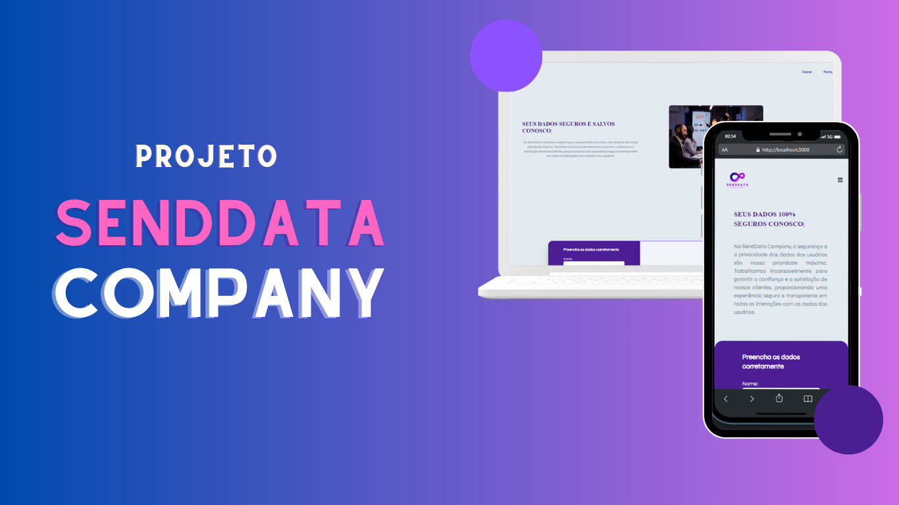
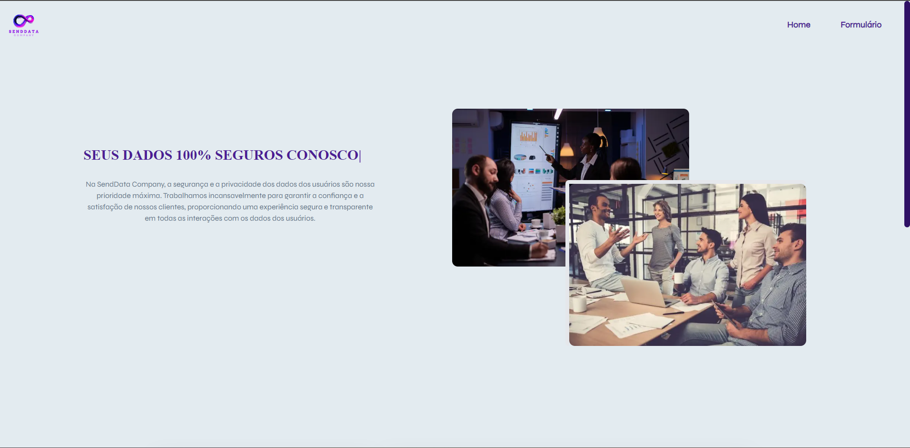

# Projeto SendData Company

Este é o repositório do projeto SendData Company que consiste em uma aplicação interativa para envio de formulário com validações e recebimento de dados de uma API. Escolhi stacks front-end pensando em criar um visual responsivo de alta performance.

A landing page é compatível com diversos tipos de resolução de telas, por exemplo: a. Desktop (1920px) b. Mobile (375px).



## 💻 Tecnologias utilizadas no projeto

- [React.js](https://reactjs.org)
- [Next](https://nextjs.org/)
- [TypeScript](https://www.typescriptlang.org)
- [Tailwind](https://sass-lang.com)
- [Zod](https://zod.dev/)
- [MaterialUI](https://mui.com/)
- [Sonner](https://sonner.emilkowal.ski/)

## 🗄️ Estrutura de pastas

O projeto está estruturado da seguinte forma:

- 📁 `public`
    - 📁 `assets`
- 📁 `src`
  - 📁 `app`
  - 📁 `assets`
  - 📁 `components`
    - 📁 `Footer`
    - 📁 `Form`
    - 📁 `Header`
    - 📁 `Hero`
    - 📁 `Select`
  - 📁 `utils`

## 🛠️ Instruções de execução

Você pode abrir o seguinte deploy para visualizar o projeto:

https://best-space-challenge.vercel.app/

OU

Siga as instruções abaixo para rodar o projeto em seu ambiente local:

1. Certifique-se de ter o Node.js instalado em seu computador. Você pode baixar a versão mais recente do Node.js em https://nodejs.org.

2. Clone este repositório em seu computador ou faça o download do código fonte.

3. Abra o terminal e navegue até o diretório raiz do projeto.

4. Instale as dependências do projeto executando o seguinte comando:

```bash
  npm install
```

5. Após a conclusão da instalação das dependências, inicie o servidor de desenvolvimento local com o comando:

```bash
  npm run dev
```

6. O servidor local será iniciado e você poderá acessar o projeto no seu navegador através do seguinte endereço:

```bash
  http://localhost:3000
```

Caso a porta 3000 estiver em uso, automaticamente o Next.js irá subir na próxima porta livre da máquina.

Se deseja alterar a porta padrão na qual a aplicação tentará subir, você pode modificar a porta no arquivo `next.config.js`.

Agora você está pronto para explorar o projeto em seu ambiente local!

## 👩‍💻 Autora

<p>
    
    <p>&nbsp&nbsp&nbspAndresa Alves<br>
    &nbsp&nbsp&nbsp<a href="https://github.com/Andresa-Alves-Ribeiro">GitHub</a>&nbsp;|&nbsp;<a href="https://www.linkedin.com/in/andresa-alves-ribeiro/">Linkedin</a>&nbsp;|&nbsp</p>
</p>
<br/><br/>
<p>

---

Feito com ❤️ por [Andresa Alves](https://github.com/Andresa-Alves-Ribeiro) 😊